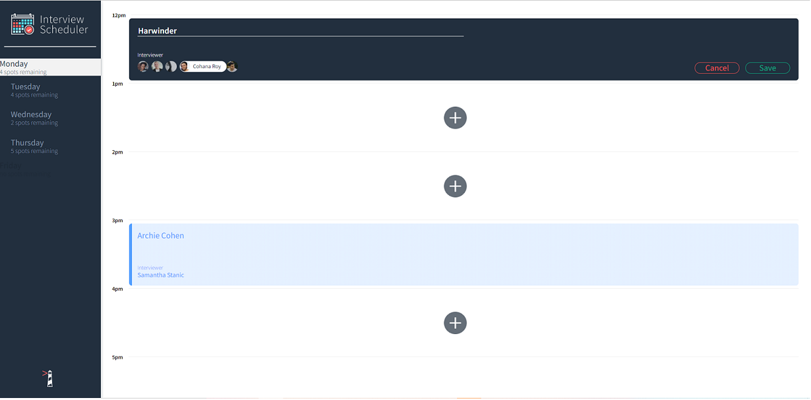
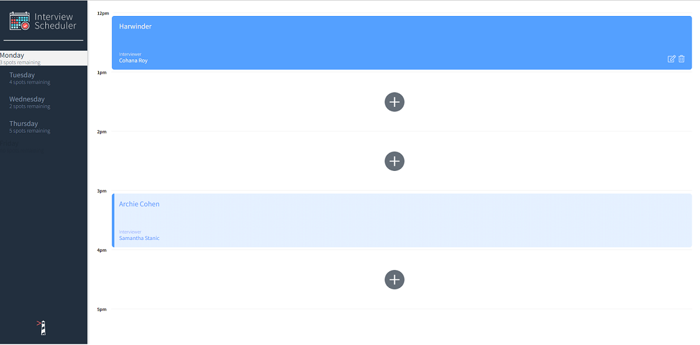
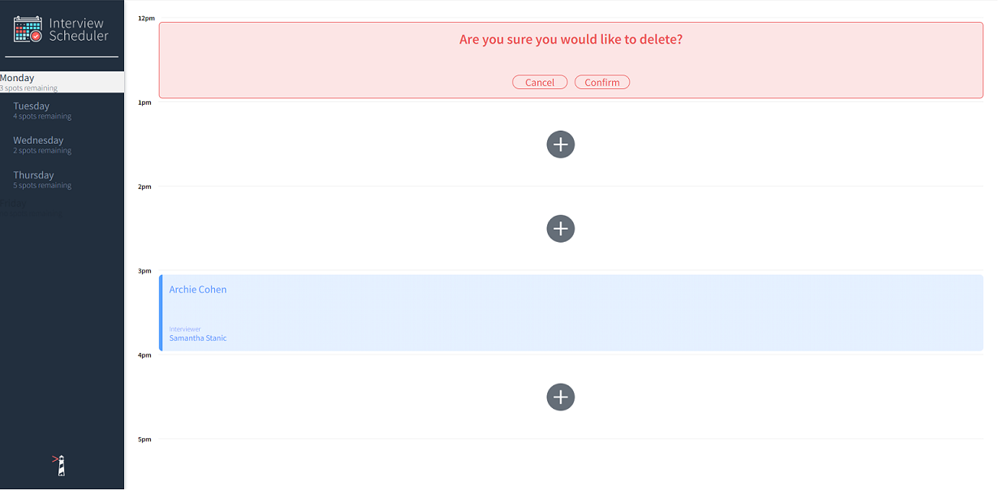
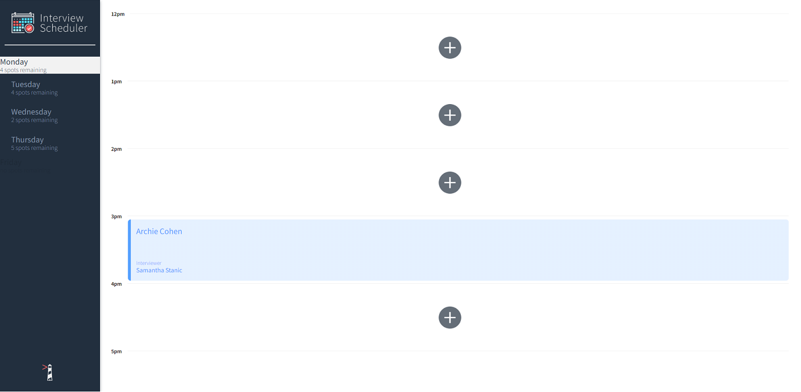

# Interview Scheduler
Using the latest tools and techniques, we build and test a React application that allows users to book and cancel interviews. We combine a concise API with a WebSocket server to build a realtime experience.

## Setup

Install dependencies with `npm install`.

## Running Webpack Development Server

```sh
npm start
```

## Running Jest Test Framework

```sh
npm test
```

## Running Storybook Visual Testbed

```sh
npm run storybook
```
## Dependencies

- React
- Axios
- Node.js
- Storybook
- Jest

## Screenshots

- We can book a new interview or edit an existing interview.
  - 

- After booking an interview, our page will be updated with a new interview. We can also see spots remaining for that day on the left side.
  - 

- We can also delete the appointment.
  - 

- After deleting an appointment, our main page will be updated and we can also see the updation in spots remaining for that day. 
  - 
